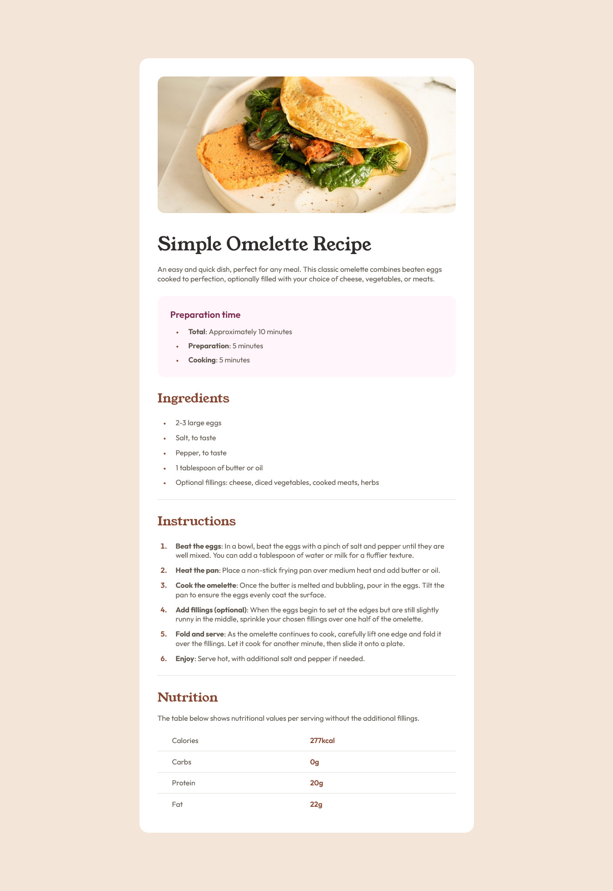

# Frontend Mentor - Recipe page solution

This is a solution to the [Recipe page challenge on Frontend Mentor](https://www.frontendmentor.io/challenges/recipe-page-KiTsR8QQKm). Frontend Mentor challenges help you improve your coding skills by building realistic projects. 

## Table of contents

- [Overview](#overview)
  - [The challenge](#the-challenge)
  - [Screenshot](#screenshot)
  - [Links](#links)
- [My process](#my-process)
  - [Built with](#built-with)
  - [What I learned](#what-i-learned)
- [Author](#author)

## Overview

### Screenshot



### Links

- Solution URL: [https://www.frontendmentor.io/solutions/recipe-page-using-html-and-css-cq930Yl9sS](https://www.frontendmentor.io/solutions/recipe-page-using-html-and-css-cq930Yl9sS)
- Live Site URL: [https://lucasngtg.github.io/recipe-page/](https://lucasngtg.github.io/recipe-page/)

## My process

### Built with

- Semantic HTML5 markup
- CSS custom properties
- Flexbox

### What I learned

It is usually better to nest a tag in ```li```, rather than putting a text on it directly. That allows for more flexibility.

## Author

- Frontend Mentor - [@LucasNgTg](https://www.frontendmentor.io/profile/LucasNgTg)
- GitHub - [@LucasNgTg](https://https://github.com/LucasNgTg)